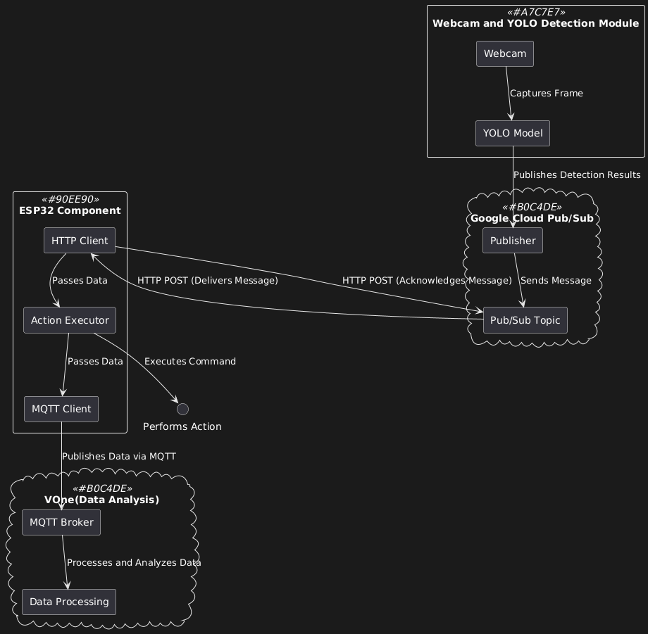

# Intelligent Waste System
 
Near Real-time Waste Bin Level Detection system, with advanced features such as AI to divide the type of trash. In our current model it detects either paper or plastic.
We use YOLO, ESP32, VOne and Google Cloud Pub/Sub.

## Key Features
- Object detection via YOLO. Paper or Plastic.
- Cloud-based data handling with Pub/Sub.
- Cloud-based data analyzation with VOne.
- Integration with ESP32 for hardware response via micro servo.
- Ultrasonic Sensor for bin level measuring, red LED lights up when bin too full

## System Architecture

*(architecture/DataFlowArchitecture.png)*

This diagram represents the complete flow of data in the system, connecting four primary components: the detection module, ESP32, Google Cloud Pub/Sub, and VONE platform for data analysis.

**Detection Module (Webcam and YOLO)**

A webcam captures frames in near real-time via python and ultralytics. The YOLO model processes each frame to detect objects (e.g., paper or plastic). Detection results are published to the Pub/Sub topic in Google Cloud.

**Google Cloud Pub/Sub**

A Publisher sends detection results to a Pub/Sub topic. The ESP32 retrieves the latest data from the Pub/Sub topic via an HTTP POST request. Upon successful retrieval, the ESP32 acknowledges the message via another HTTP POST request.

**ESP32 Component**

The ESP32 receives data from Google Cloud, executes actions based on the detection results, and uses an MQTT client to forward this and the ultrasonic sensor data to VONE.

**VONE**

VONEs MQTT Broker receives data from the ESP32. The data is processed and analyzed within Platform VOne's data processing component. 

This flow ensures seamless integration between object detection, cloud messaging, action execution, and data analysis.

## Setup, Configuration and Installation

**VIEW README in Github project**

## Troubleshooting
Due to the nature of the authentication token creation the token will expire after 1 hour.

Labeling and collecting the data was more work than imagined and also wasnt good enough. The model is not working absolutely accurate but this would need way more time.

Unfortunately the system is not working at real-time as the detected object is first send to the cloud and then it gets pulled by the esp32. This is sub-optimal, we tried a lot of different ways however this seemed to be the one that works and the others didn't.

## Links

[GitHub](https://github.com/Kolumnist/Material-Detection)

[Video Presentation](https://youtu.be/oSeENyNx8Qo)